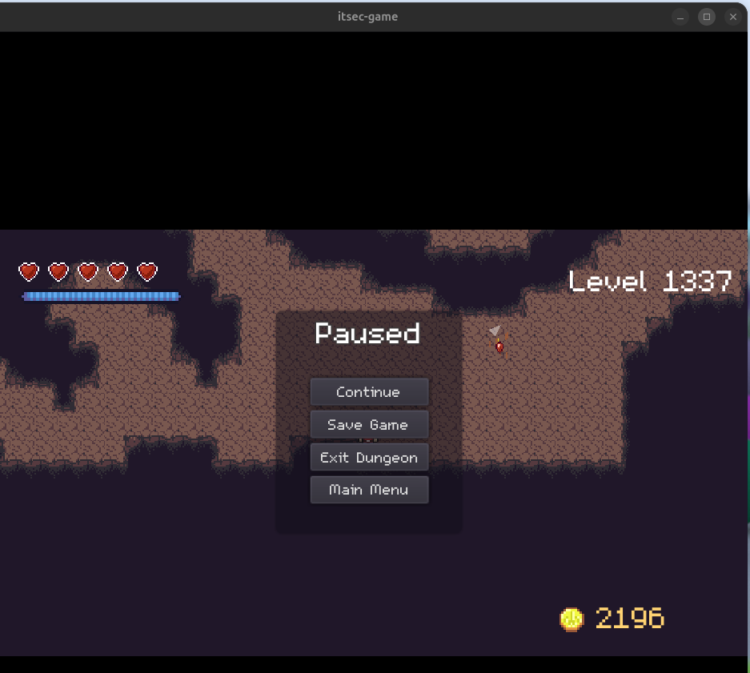
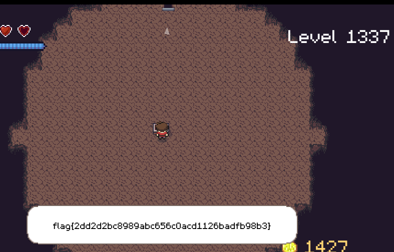

# 1. und 2. Versuch

Bei meinen ersten beiden erfolgreichen Versuchen hab ich mit Hilfe von scanmem die möglichen Adressen einzugrenzen.

Bei jedem Level im Dungeon hab ich den exakten Wert oder + verwendet in scanmem eingegeben, wodurch die Anzahl an möglichen Adressen verringert hat. Jedoch hat das Vermischen von exakten Wert und + manchmal zu Folge gehabt, dass es 0 Matches gab.

Beim 1.Versuch ist das Spiel direkt abgestürzt.
Beim 2.Versuch bin ich bei 1337 direkt aus dem Dungeon und beim Käufer stürzte das Spiel ab, da ich versucht hab ne Geld Variable zu ändern.

## 3.Versuch

Hier hab ich immer nur den exakten Wert verwendet.

Ich hatte bei Level 6 7 Matches und ich hab die 2.Adresse auf 1337, da die 1.Adresse nur ein Byte enthält und somit nicht für 1337 reicht.

Dann bin ich durch die Tür und nach Bekämpfen der Monster hab ich die Truhe mit der Flagge gefunden.

